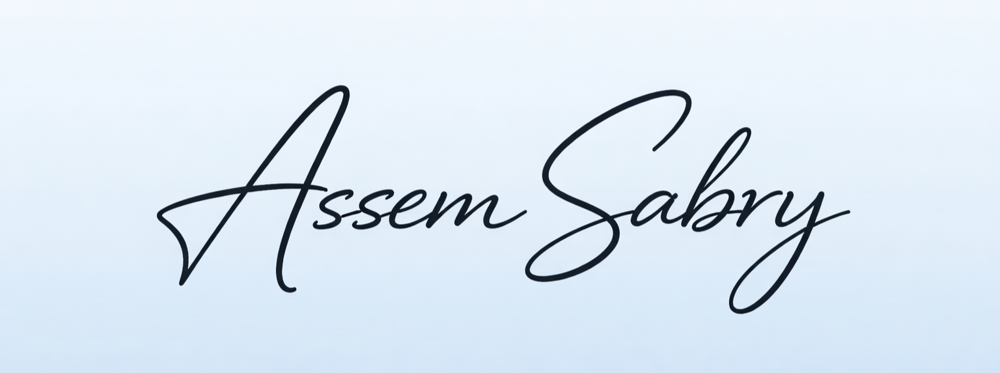
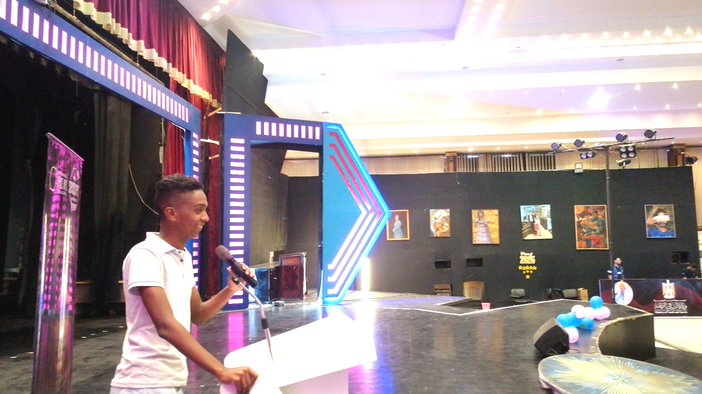
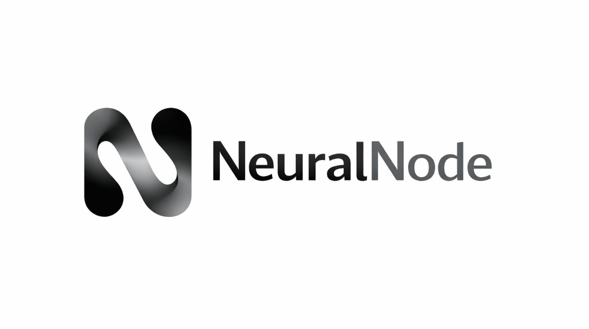
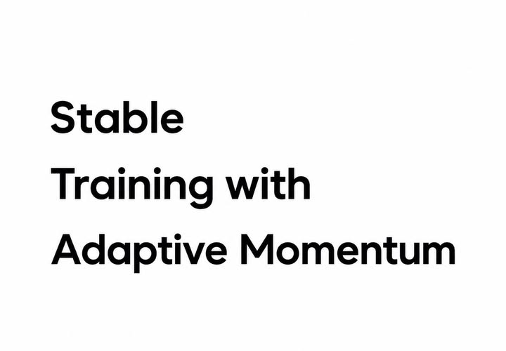

<div align="center">
  

  <h1>AI Engineer & Researcher | Founder & CEO of <a href="https://tokenai.cloud/">TokenAI</a></h1>

  <a href="https://www.linkedin.com/in/assem7/"></a>
  <a href="https://assem.cloud/"></a>
  <a href="https://www.facebook.com/assemsabryy"></a>
  <a href="https://huggingface.co/assemsabry"></a>
</div>

<h2 align="center">About Me</h2>

<div align="center">
  
</div>

My journey in Artificial Intelligence spans from foundational learning to pioneering research and professional enterprise solutions. Here is a brief timeline of my professional experience:

- **Learning Programming & Computer Vision (2021 - 2023):** Started my journey focusing on computer vision techniques and foundational coding skills.
- **AI Engineering (2023 - Present):** Building and deploying intelligent systems, mastering machine learning algorithms, and advanced AI architectures.
- **Freelancing (2024 - Present):** Providing professional AI and software development services to clients worldwide.
- **AI & ML Research (2025 - Present):** Actively conducting research to explore cutting-edge technologies and innovative solutions.
- **Founding TokenAI (2025 - Present):** Building an AI startup focused on developing state-of-the-art language models and democratizing access to AI technologies.

---

## Featured Projects

<div align="center">
  
</div>

### Horus AI Models Family

**Horus 1.0 4B**
The First AI Models trained from scratch in Egypt. It is a text generation model built upon the Llama architecture. 

Read all the details here: [Horus 1.0 4B Official Page](https://tokenai.cloud/models/horus-1-0-4b)

---

### NeuralNode 

<div align="center">
  
</div>

A complete framework for building AI Agents, available in Python.

```bash
pip install neuralnode
```

#### What is NeuralNode?

The NeuralNode framework is a complete and user-friendly framework for building AI Agents in Python. It is designed to help you construct AI agents capable of executing complex tasks efficiently.

#### Key Features:
- **Comprehensive LLM Support**: Integrate seamlessly with OpenAI, Anthropic, Google Gemini, Ollama, and Hugging Face Transformers.
- **Advanced Capabilities**: Built-in RAG, Vector Search, automated web browsing, distributed computing with Ray, and secure code execution.
- **High Security**: Command whitelist system and code execution within isolated Docker containers using an OAuth2 email system.
- **Automated Training & RL System**: Features PPO, DQN, and A2C algorithms with transfer learning capabilities and a customizable reward/penalty system.
- **Learning from Interaction**: The agent autonomously learns your style and automates your repetitive tasks over time by adapting to context.

Build your smart AI Agent with browser access, fetch reliable web results, and communicate with it easily through Telegram!

[NeuralNode on PyPI](https://pypi.org/project/neuralnode)

---

<h2 align="center">Researches</h2>

### Stable Training with Adaptive Momentum STAM

<div align="center">
  
</div>

**Stable Training with Adaptive Momentum (STAM)** is an innovative optimization method that dynamically adapts the first-order momentum coefficient based on a per-tensor gradient variance proxy. Unlike traditional methods like Adam and AdamW that use a fixed momentum coefficient, STAM reduces overshooting in high-variance regimes to dampen oscillations while accelerating convergence in low-variance situations.

The research also introduces **STAMLite**, a highly memory-efficient variant that requires only O(1) extra state per parameter, matching the memory footprint of AdamW. Across comprehensive benchmark phases, STAM and STAMLite achieved top-3 performance on 83% of the scored phases and won outright on hyperparameter robustness.

**Learn more about the research here:**
[STAM Research Details](https://tokenai.cloud/research/stam)

---

### SSRN Publication

<div align="center">
  
</div>

The STAM research paper has been officially published and gained significant recognition, ranking among the top 500,000 globally on the SSRN platform. 

**Read the full Research Paper on SSRN:**
[Research Paper](https://papers.ssrn.com/sol3/papers.cfm?abstract_id=6699059)
